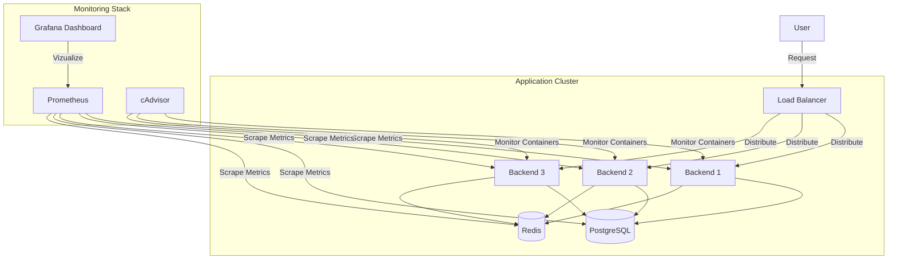

# Portfolio Application - High Availability & Cloud Monitoring

> **Aplikasi Portfolio Modern** dengan arsitektur Cloud Native yang dilengkapi dengan Load Balancing, Horizontal Scaling, dan Real-time Monitoring System.


---

## 📋 Daftar Isi

1. [Overview & Arsitektur](#-overview--arsitektur)
2. [Fitur Utama](#-fitur-utama)
3. [Prasyarat](#-prasyarat)
4. [Instalasi & Konfigurasi](#-instalasi--konfigurasi)
5. [Menjalankan Aplikasi (Start)](#-menjalankan-aplikasi-start)
6. [Mengakses Dashboard](#-mengakses-dashboard)
7. [Stress Testing](#-stress-testing)
8. [Menghentikan Aplikasi (Stop)](#-menghentikan-aplikasi-stop)

---

## 🏗 Overview & Arsitektur

Aplikasi ini bukan sekadar website biasa, melainkan simulasi infrastruktur **Cloud Enterprise**. Sistem ini dirancang agar **selalu hidup (High Availability)** dan **terpantau (Observable)**.

### Diagram Arsitektur


---

## 🚀 Analisis Fitur (Kesesuaian Tugas)

Aplikasi ini telah memenuhi kriteria sistem terdistribusi modern:

### 1. 📈 Scalable (Skalabilitas)
Kemampuan sistem untuk menangani lonjakan beban trafik.
*   **Horizontal Scaling**: Menggunakan 3 Replica Backend (`backend_1`, `backend_2`, `backend_3`) yang berjalan paralel. Kapasitas mudah ditambah hanya dengan mengubah angka replika.
*   **Load Balancing**: **Nginx** mendistribusikan trafik secara adil ke backend menggunakan algoritma `least_conn`.
*   **Caching Strategy**: **Redis** mengurangi beban database dengan menyimpan data yang sering diakses di memori (RAM).

### 2. 🛡️ Reliable (Keandalan)
Kemampuan sistem untuk tetap beroperasi meskipun terjadi kegagalan komponen.
*   **Automatic Failover**: Jika salah satu Backend mati, Nginx otomatis mengalihkan request ke backend lain yang masih hidup.
*   **Health Checks**: Docker memantau kesehatan semua service (`pg_isready`, `redis-cli ping`). Container yang "sakit" tidak akan dikirimi trafik.
*   **Data Persistence**: Database PostgreSQL menggunakan **Docker Volumes** sehingga data tidak hilang meskipun container dihapus/restart.

### 3. 🔐 Secure (Keamanan)
Perlindungan sistem dari akses tidak sah dan kerentanan standar.
*   **Network Isolation**: Backend dan Database berkomunikasi di jaringan privat (`portfolio_network`), tidak terekspos langsung ke publik.
*   **Reverse Proxy**: Server asli (Node.js) tersembunyi di belakang Nginx, IP server asli aman.
*   **Secure Headers (Helmet.js)**: Backend dilindungi dari serangan umum XSS dan HTTP Headers injection.
*   **Rate Limiting**: Mencegah serangan DDoS dengan membatasi jumlah request per detik baik di level Nginx maupun Aplikasi.
*   **Environment Variables**: Password dan API Key vital disimpan aman di `.env`.

### 4. 📊 Observable (Pemantauan)
*   **Monitoring Stack**: Prometheus & Grafana memberikan visibilitas penuh terhadap "kesehatan" setiap komponen Scalable, Reliable, dan Secure di atas.

---

## 📋 Prasyarat

Pastikan Anda sudah menginstal:
*   **Git Bash** (Untuk clone repo)
*   **Docker Desktop** (Wajib menyala)

---

## ⚙ Instalasi & Konfigurasi

### 1. Clone Repository
Download source code ke komputer Anda:
```bash
git clone https://github.com/username-anda/Profil-Web-rafky.git
cd Profil-Web-rafky
```

### 2. Buat Environment Variable
Copy file contoh `.env` (jika ada) atau buat file baru bernama `.env`:
```env
# Database Credentials
DB_PASSWORD=secure_password_123
POSTGRES_USER=postgres
POSTGRES_DB=portfolio_db

# Redis
REDIS_PASSWORD=secure_redis_password_123

# App Config
FRONTEND_URL=http://localhost
NODE_ENV=production
```

---

## ▶ Menjalankan Aplikasi (Start)

Karena kita menggunakan modul Monitoring tambahan, perintah menjalankannya sedikit lebih panjang dari biasanya. Kita perlu menggabungkan dua file konfigurasi.

**Jalankan perintah ini di Terminal / PowerShell:**

```powershell
docker-compose -f docker-compose.yml -f docker-compose.monitoring.yml up -d --build
```

> **Tunggu sebentar...**
> Docker akan mendownload image dan menjalankan sekitar **10 Container**. Pastikan semuanya statusnya `Started` atau `Healthy` dengan perintah:
> `docker ps`

---

## 🖥 Mengakses Dashboard

Setelah semua berjalan, berikut alamat aksesnya:

| Layanan | URL | Kredensial Default | Fungsi |
| :--- | :--- | :--- | :--- |
| **Website Utama** | [http://localhost](http://localhost) | - | Halaman Portfolio |
| **Grafana** | [http://localhost:3002](http://localhost:3002) | `admin` / `admin` | Dashboard Monitoring Visual |
| **Prometheus** | [http://localhost:9090](http://localhost:9090) | - | Data Mentah Metrik |
| **cAdvisor** | [http://localhost:8080](http://localhost:8080) | - | Status Fisik Container |

**Tips Grafana:**
1.  Buka `http://localhost:3002`
2.  Login dengan `admin` / `admin` (Skip change password jika diminta).
3.  Buka Menu **Dashboards** > **Browse** > Klik **"Portfolio App Monitoring"**.
4.  Nikmati grafik real-time! 📊

---

## ⚡ Stress Testing

Ingin melihat grafik bergerak naik? Lakukan uji beban (Stress Test) tanpa instalasi tambahan:

```powershell
docker run --rm --network portfolio_network jordi/ab -n 1000 -c 100 http://portfolio_frontend/
```
*Perintah ini akan menembakkan 1000 request secepat kilat ke server Anda.*

---

## 🛑 Menghentikan Aplikasi (Stop)

Untuk mematikan seluruh sistem (Aplikasi + Monitoring) dan membersihkan memori:

```powershell
docker-compose -f docker-compose.yml -f docker-compose.monitoring.yml down
```

---

**Cloud Computing & Distributed Systems Project**

